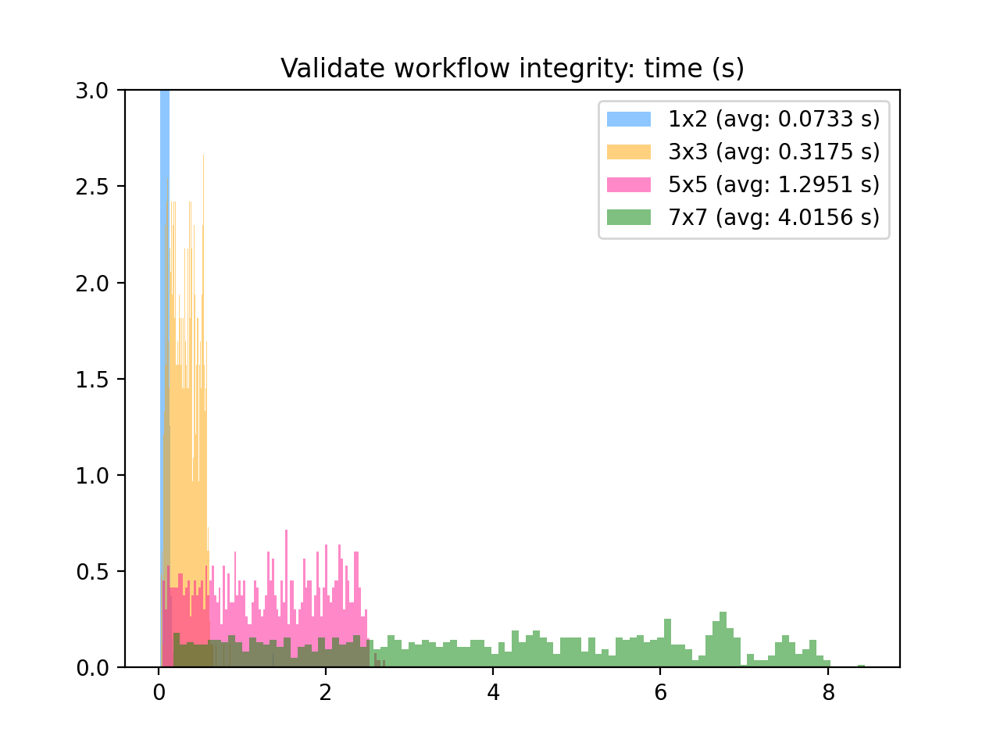
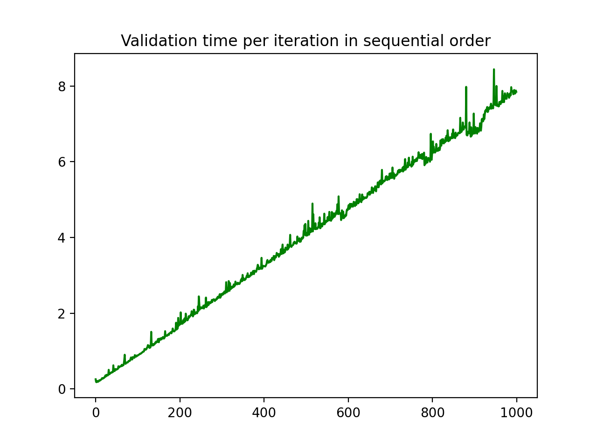
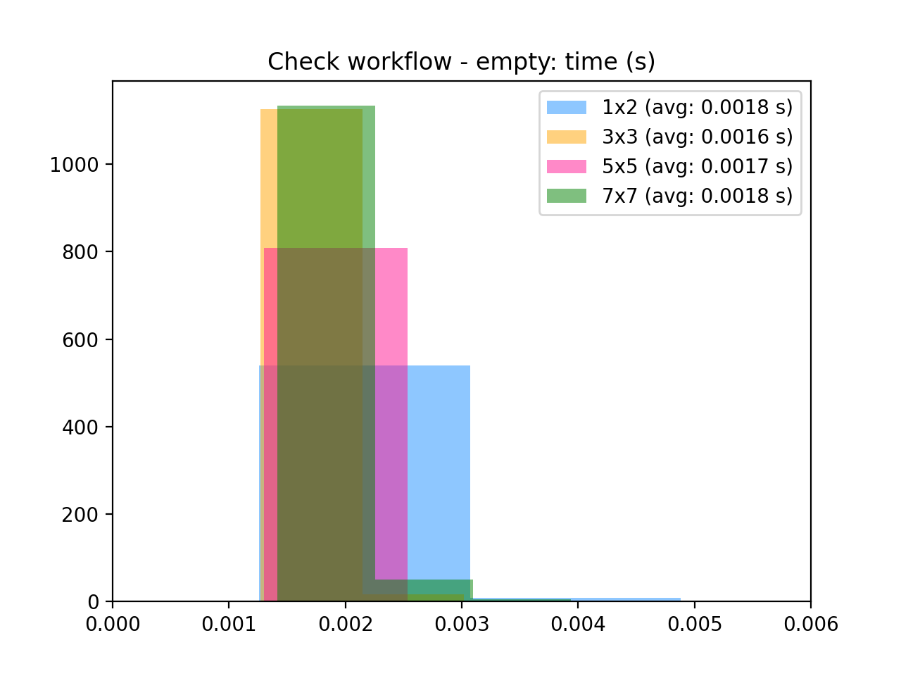
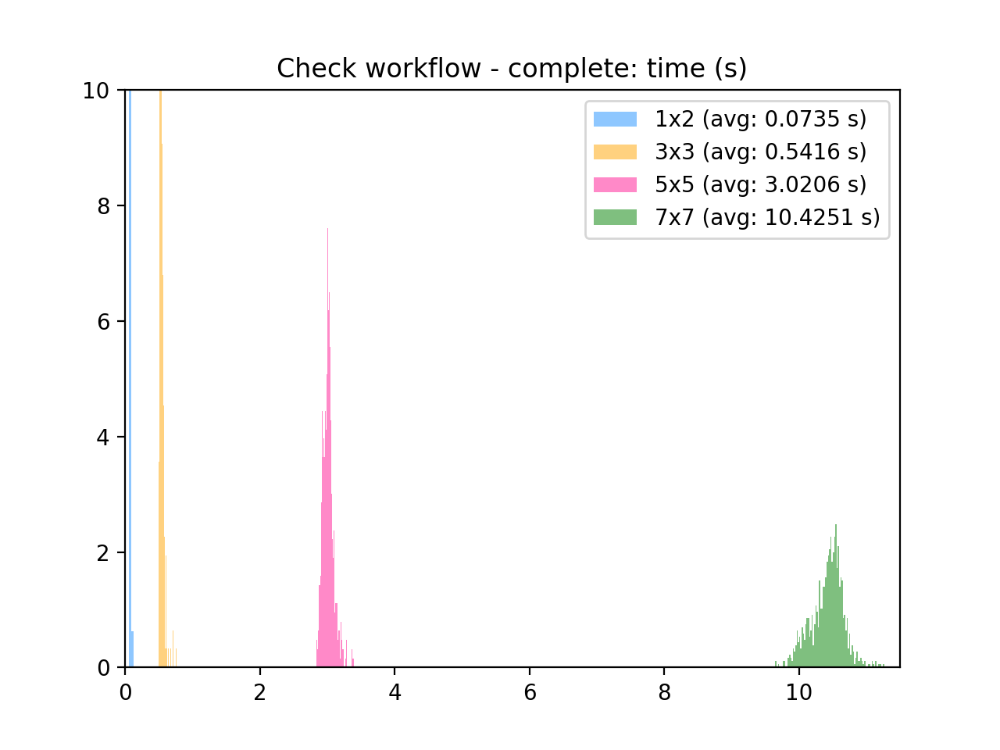

# Notary Service Neo4j - metrics

Collect measurement times for the load, validate and workflow completion aspects of Notary Service as they relate to Neo4j performance. Each graph based stage will be repeated, or iterated over, 1000 times and then plot as a histogram distribution for comparison.

## Graph samples

Representative Neo4j graphs using Notary Service rules have been created with the following configurations (all graphs have a start and stop node in addition to the dimensions listed below)

- 1 x 2 (current minimum valid size supported by framework)
- 3 x 3
- 5 x 5 (see sample from yEd below)
- 7 x 7


**Figure 1:** Sample 5 x 5 graph

## Measurements

Measurements have been gathered using a standalone Neo4j container configured as it would be for Notary Service. The container is then interrogated by Python scripts from the host using the same libraries that are used by the Notary Service application.

Python is run from a virtual environment using `virtualenv`

```
virtualenv -p ${PATH_TO_PYTHON3} venv
source venv/bin/activate
pip install -r requirements.txt
```

Execution time is measured using the built-in python [`time`](https://docs.python.org/3/library/time.html) function.

Metrics will be generated for the following Notary Service tasks

### Load

Time to load/import a specified GraphML file into Neo4j, measured per graph over 1000 iterations

### Validate

Time to validate the newly created Neo4j workflow after it has been loaded, measured per graph over 1000 iterations

### Time to check initial workflow

Time to check for completeness of a specified, but known empty (no nodes marked as completed) Neo4j workflow, measured per graph over 1000 iterations

### Time to check for completed workflow

Time to check for completeness of a specified, but known complete (all nodes marked as completed) Neo4j workflow, measured per graph over 1000 iterations

## Running the code

Start the `neo4j` docker container and verify that it is running as expected.

```
docker run -d \
  --user=$(id -u):$(id -g) \
  --name neo4j \
  -v $(pwd)/files/neo4j/data:/data \
  -v $(pwd)/files/neo4j/imports:/imports \
  -v $(pwd)/files/neo4j/logs:/logs \
  -p 7474:7474 \
  -p 7473:7473 \
  -p 7687:7687 \
  -e NEO4J_AUTH=neo4j/password \
  rencinrig/neo4j-apoc:3.5.0
```

Ensure that the container is running

```
$ docker ps
CONTAINER ID        IMAGE                        COMMAND                  CREATED             STATUS              PORTS                                                      NAMES
772180f0d5de        rencinrig/neo4j-apoc:3.5.0   "/sbin/tini -g -- /d…"   40 seconds ago      Up 39 seconds       0.0.0.0:7473-7474->7473-7474/tcp, 0.0.0.0:7687->7687/tcp   neo4j
```

Check the STDOUT of the container for the bolt connection

```
$ docker logs neo4j
command failed: the provided initial password was not set because existing Neo4j users were detected at `/var/lib/neo4j/data/dbms/auth`. Please remove the existing `auth` file if you want to reset your database to only have a default user with the provided password.
Active database: graph.db
Directories in use:
  home:         /var/lib/neo4j
  config:       /var/lib/neo4j/conf
  logs:         /logs
  plugins:      /var/lib/neo4j/plugins
  import:       /var/lib/neo4j/import
  data:         /var/lib/neo4j/data
  certificates: /var/lib/neo4j/certificates
  run:          /var/lib/neo4j/run
Starting Neo4j.
...
2020-03-29 00:22:07.270+0000 INFO  ======== Neo4j 3.5.0 ========
2020-03-29 00:22:07.281+0000 INFO  Starting...
2020-03-29 00:22:17.037+0000 INFO  Bolt enabled on 0.0.0.0:7687.
2020-03-29 00:22:19.383+0000 INFO  Started.
2020-03-29 00:22:20.751+0000 INFO  Remote interface available at http://localhost:7474/
```

## Scripts

A small set of scripts have been provided to run the measurement tests as well as parse/plot the generated output.

**metrics_main.py** - Main script to run the metrics functions

**metrics_neo4j.py** - Helper functions that link to the Notary Service `ns_workflow` packages

**metrics_plot.py** - Plots used for processing the data post collection

### Usage

**metrics_main.py**:

```
$ python metrics_main.py --help
usage: metrics_main.py [-h] [--generateids INT] [--importgraph PATH]
                       [--checkworkflow PATH] [--completeall] [--removegraph]
                       [--createindices]

Notary Service Neo4j metrics

optional arguments:
  -h, --help            show this help message and exit
  --generateids INT     Number of unique identifiers to generate
  --importgraph PATH    Path to graphml file to be used as Neo4j import file
  --checkworkflow PATH  Check all workflows for completeness
  --completeall         Set all workflow nodes to completed=True
  --removegraph         Remove all existing graphs from Neo4j
  --createindices       Create graph indices in Neo4j
```

**Example**: Generate metrics for the [one-by-two.graphml]() over 1000 iterations

Create the indices for Neo4j to use when performing graph search

```
$ python metrics_main.py --createindices
Namespace(checkworkflow=None, completeall=False, createindices=True, generateids=None, importgraph=None, removegraph=False)
```

This only needs to be done once, and when completed the new Indexes should be denoted as being `ONLINE` when perforing the `:schema` call from the Neo4j Browser

```
$ :schema
---
Indexes
   ON :Node(GraphID) ONLINE 
   ON :Node(GraphID, ID) ONLINE 
   ON :Node(GraphID, ID, Type) ONLINE 
   ON :Node(GraphID, Type) ONLINE 

No constraints
```

Create 1000 unique IDs

```console
$ python metrics_main.py --generateids 1000
Namespace(checkworkflow=None, completeall=None, generateids=1000, importgraph=None, removegraph=False)
File with 1000 unique IDs has been created as: 'files/uuid.json'
```

Load / Validate the `one-by-two.graphml` file and resulting workflow over 1000 iterations

```console
$ python metrics_main.py --importgraph sample-graphs/one-by-two.graphml
Namespace(checkworkflow=None, completeall=False, createindices=False, generateids=None, importgraph='sample-graphs/one-by-two.graphml', removegraph=False)
Generate import metrics for: sample-graphs/one-by-two.graphml
  - Running with 1000 iterations:
...
{
    "graph": "one-by-two.graphml",
    "count": 1000,
    "metrics_load": {
        "total": 13.755941152572632,
        "average": 0.013755941152572632,
        "units": "seconds"
    },
    "metrics_validate": {
        "total": 18.83089303970337,
        "average": 0.01883089303970337,
        "units": "seconds"
    }
}
File with load/validate metrics saved as: files/load-one-by-two.graphml.json
```

Measure check time for the clean workflow over 1000 iterations

```console
 python metrics_main.py --checkworkflow sample-graphs/one-by-two.graphml
Namespace(checkworkflow='sample-graphs/one-by-two.graphml', completeall=False, createindices=False, generateids=None, importgraph=None, removegraph=False)
Check for workflow completeness using graph: sample-graphs/one-by-two.graphml
  - Running with 1000 iterations:
...
{
    "graph": "one-by-two.graphml",
    "count": 1000,
    "metrics_check": {
        "total": 1.8472473621368408,
        "average": 0.001847247362136841,
        "units": "seconds"
    }
}
File with load/validate metrics saved as: files/check-false-one-by-two.graphml.json
```

Set complete = True for all nodes over the 1000 workflows

```console
$ python metrics_main.py --completeall
Namespace(checkworkflow=None, completeall=True, createindices=False, generateids=None, importgraph=None, removegraph=False)
Set all workflow nodes as completed
3371705a-8aad-4f72-996f-13be73f8f70a
2b47c160-fc2f-4c58-9339-284ac73822e3
80fc340a-dcd4-465c-8968-9b1b06b3e522
...
```

Measure check time for the completed workflow over 1000 iterations

```console
$ python metrics_main.py --checkworkflow sample-graphs/one-by-two.graphml
Namespace(checkworkflow='sample-graphs/one-by-two.graphml', completeall=False, createindices=False, generateids=None, importgraph=None, removegraph=False)
Check for workflow completeness using graph: sample-graphs/one-by-two.graphml
  - Running with 1000 iterations:
...
{
    "graph": "one-by-two.graphml",
    "count": 1000,
    "metrics_check": {
        "total": 7.993805885314941,
        "average": 0.00799380588531494,
        "units": "seconds"
    }
}
File with load/validate metrics saved as: files/check-true-one-by-two.graphml.json
```

Remove all workflow graphs from Neo4j over 1000 iterations

```console
$ python metrics_main.py --removegraph
Namespace(checkworkflow=None, completeall=False, generateids=None, importgraph=None, removegraph=True)
Remove all Neo4j graphs
ab079f0a-08c4-45ef-8077-9fcb851f15b8
2a0f3d48-f998-4e3e-b08c-b0fd0481dcb2
295dd25b-6067-470c-85f1-cfdbc2d8f82a
...
```

Output files are generated in JSON format for each run containing metrics data as well as the unique IDs

```console
$ ls -1 files
check-false-one-by-two.graphml.json # Time to check new workflows
check-true-one-by-two.graphml.json  # Time to check completed workflows
load-one-by-two.graphml.json        # Time to load graphml file and Validate workflow graph
uuid.json                           # List of unique IDs as UUID
```

## Results

Measurement metrics have been subdivided into four stages based on how the Notary Service code interacts with Neo4j.

1. Load workflow from GraphML file - yEd is used to generate a GraphML file that is imported into Neo4j. The example graphs will have an internal node structure of 1x2, 3x3, 5x5 and 7x7 (not including start and stop nodes)

2. Validate workflow integrity - Once the GraphML file is imported into Neo4j it needs to be validated to ensure that it conforms to the rules established for Notary Service. In simple terms, the graph must be directed, acyclic, and contain a single start node and a single stop node.

3. Check workflow when empty - When a workflow is first created it will not contain any completed nodes related to Notary Service tasks. This is the simplest form of the graph to run the check algorithm over as it only needs to check the first available nodes the user can interact with. In the example graphs this is expressed as the initial fanout from the start node (number of columns), so 2, 3, 5 and 7 nodes.

4. Check workflow when complete - When a workflow is completed it will contain all required node properties related to the successful completion of a workflow in Notary Service. This is the most complex form of the graph to run the check algorithm over as all nodes need to be checked.

Wrapper code has been written to replace Notary Service calls that exercise each stage being measured. It should be noted that the wrapper code has not been optimized, and may represent a worst case scenario for memory management and stressing the systems I/O.

### Overall averages

Average time in seconds to run 1000 iterations at each stage.

| Graph/Workflow | Load | Validate | Check Empty | Check Complete |
|:--------:|:----:|:--------:|:-----------:|:--------------:|
|one-by-two|0.013756|0.018831|0.001847|0.007994|
|three-by-three|0.019866|0.021609|0.001628|0.023616|
|five-by-five|0.038592|0.049538|0.001689|0.058089|
|seven-by-seven|0.065623|0.112632|0.001846|0.108225|

See below for a more detailed explanation of each stage

### Load workflow from GraphML file

Using the yEd [sample graphs](sample-graphs/) as representative Notary Service workflow templates, measure the import time over 1000 iterations and plot the distribution.


### Validate workflow integrity

After the 1000 graphs have been imported into Neo4j, run the Notary Service validation checks over them. This process can be memory intensive and has been performed in a single threaded `for` loop.



When the 7x7 workflow validation results are plotted in the order which measurements were taken, it can be observed that there is a slight additive trend towards each iteration taking more time than the preceding check. There is also an abrupt jump in time which we suspect is due to change in index memory management once the number of subgraphs reach a certain size.



### Check workflow when empty

Newly validated workflows are considered to be "empty" in that none of the user claims have been attested to. This means that the property designated for capturing user attestations would be `None` or `NULL` in value. The workflow completeness check will begin walking the graph from the start node, and return the subset of all initial nodes that do not yet have an attestation associated to them. Using the provided sample graphs the initial number of nodes checked prior to return will correlate to the number of columns in each graph, so 2, 3, 5, and 7 nodes respectively.



### Check workflow when complete

Workflows are considered complete once all viable paths from the start node to the stop node have been completed for all user roles associated with each graph. Using the provided sample graphs the completed number of nodes checked prior to return will correlate to the number of rows x columns in each graph, so 2, 9, 25, and 49 nodes respectively.


